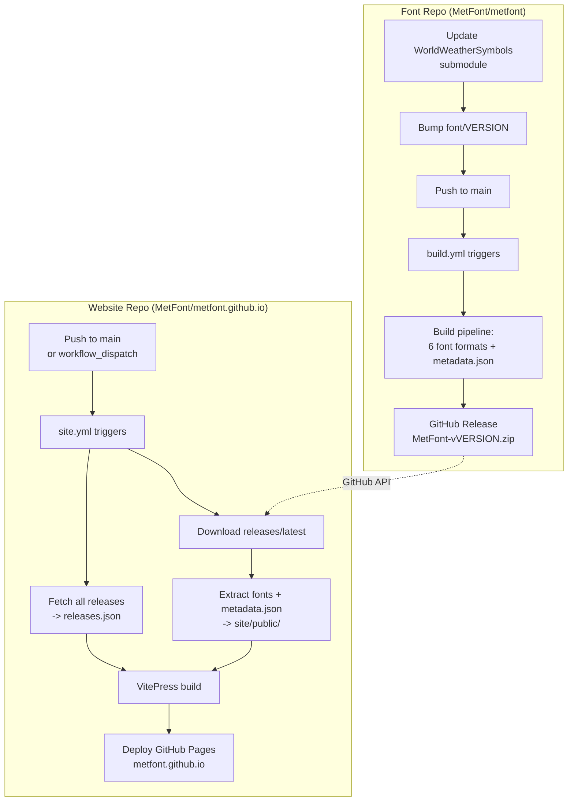

# MetFont Website

Public website for [MetFont](https://github.com/MetFont/metfont) — 541 WMO/ICAO meteorological symbols as a Unicode font.

Live site: https://metfont.github.io

## Architecture

The website is decoupled from the font build. The font repo produces versioned
releases; the website downloads and serves them at CI time.

### Release and Deploy Flow



### Version Flow

`font/VERSION` is the single source of truth for the font version. It propagates through the entire pipeline:

| Artifact | Source | Format |
|----------|--------|--------|
| Font binary (nameID 5) | `font/VERSION` | `Version 1.0.1` |
| `metadata.json` field `version` | `font/VERSION` | `1.0.1` |
| `icons.json` field `props.version` | `font/VERSION` | `001.000` (nanoemoji) |
| Package zip filename | `font/VERSION` | `MetFont-v1.0.1.zip` |
| GitHub Release tag | `font/VERSION` | `v1.0.1` |
| Website header badge | `metadata.json` | `v1.0.1` |
| Website version history | `releases.json` | All releases with dates |

### Font Release Process

1. Update the WorldWeatherSymbols submodule in the font repo
2. Bump `font/VERSION` (e.g. `1.0.0` to `1.0.1`)
3. Push to main — CI builds fonts and creates a GitHub Release automatically
4. Trigger a website rebuild: `gh workflow run site.yml --repo MetFont/metfont.github.io`

The website CI downloads the latest release from the font repo, extracts fonts and metadata, fetches the full release history, then builds and deploys.

## Structure

```
site/               VitePress application
  components/       Vue components (UI sections and detail views)
  .vitepress/       VitePress configuration and theme overrides
    theme/          Custom theme (Layout.vue, CSS overrides)
    styles.css      Global CSS with design tokens (dark/light themes)
  public/           Static assets served as-is (logos, favicons, fonts)
  index.md          VitePress entry page
  package.json      VitePress dependencies

.github/workflows/
  site.yml          GitHub Actions: download font release -> build -> deploy to GitHub Pages
```

## Build

The site downloads the pre-built font package (fonts + `metadata.json`) from the [MetFont releases](https://github.com/MetFont/metfont/releases/latest) at CI time. No font build tooling is needed locally.

```bash
cd site
npm install
npm run build   # builds into site/.vitepress/dist/
npm run dev     # dev server with hot reload
```

For local development, you can manually download the font package and extract it to `site/public/`:

```bash
# Download latest release
curl -sL $(curl -sL https://api.github.com/repos/MetFont/metfont/releases/latest \
  | python3 -c "import sys,json; print(next(a['browser_download_url'] for a in json.load(sys.stdin)['assets'] if a['name'].endswith('.zip')))") \
  -o MetFont.zip
unzip -o MetFont.zip -d /tmp/metfont-release
cp /tmp/metfont-release/*.woff2 /tmp/metfont-release/*.ttf /tmp/metfont-release/*.otf site/public/
cp /tmp/metfont-release/metadata.json site/public/
```

## Font Assets

Fonts and `metadata.json` are downloaded from `releases/latest` during CI and placed in `site/public/`. They are not committed to the repo.

## Theme

The site uses a custom VitePress theme with CSS design tokens for dark/light mode. The font (MetFont) is loaded via `@font-face` pointing to `/MetFont-glyf.woff2`.
